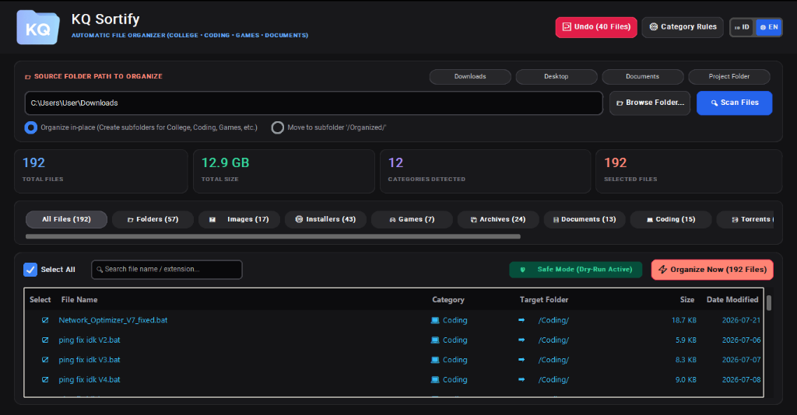

<div align="center">
  
</div>

<br/>

<div align="center">
  <p><strong>Intelligent, Rule-Based Desktop File Organizer with Dark Mode GUI & Smooth Animations</strong></p>

  [](https://www.python.org/)
  [](https://customtkinter.tomschimansky.com/)
  [](https://microsoft.com/windows)
  [](LICENSE)
</div>

---

## 📸 Interface Preview

<div align="center">
  
  <p><em>Modern Dark Mode Interface featuring Real-Time Bilingual Toggle (ID / EN), Safe Dry-Run, Stats Dashboard & Category Pills</em></p>
</div>

---

## 🌟 Overview

**KQ Sortify** is a lightweight, rule-based file organizer that turns cluttered folders into organized ones. It scans filenames and file extensions, matches them to custom rules, and automatically moves files into categorized destination folders.

You can define your own keywords, categories, and folder structure, making KQ Sortify flexible for personal use, office work, school files, project directories, or any messy folder that needs order.

No more manual sorting. Create your rules once, run KQ Sortify, and let it handle the cleanup!

---

## ✨ Features

- 🎨 **Modern Dark Mode GUI**: Built with CustomTkinter featuring smooth 60+ FPS ease-out hover animations, luminous border glow, and tactile click feedback.
- 🌐 **Bilingual Support (ID / EN)**: Instant one-click switch between **Indonesian 🇮🇩** and **English 🌐** across the entire interface.
- 🛡️ **Safe Dry-Run & Interactive Preview**: Preview all files, target destinations, sizes, and dates before moving anything. Deselect any files you wish to keep intact.
- ↩️ **One-Click Undo (Rollback)**: Made a mistake? Revert sorted files back to their exact original locations anytime with full batch history journaling.
- ⚡ **Lightweight & High Performance**: 60 FPS buttery-smooth scrolling with native dark table view and bounded size sampling that never freezes or triggers "Not Responding".
- ⚙️ **Smart Prioritized Classification**:
  - 🎓 **Kuliah / College**: Keywords prioritized (`tugas`, `materi`, `kalkulus`, `alpro`, `thesis`, etc.)
  - 💻 **Coding**: Source code (`.py`, `.cpp`, `.js`, `.ts`, `.html`, `.css`, etc.)
  - 🎮 **Games**: Game setups, ISOs, and ROMs (`.iso`, `.rom`, `fitgirl`, `repack`, `steam`, etc.)
  - 📄 **Documents**: PDFs, Word, Excel, Presentations, and Text files.
  - 📦 **Archives**: Compressed files (`.zip`, `.rar`, `.7z`, `.tar`, `.gz`).
  - 🖼️ **Media**: Images, Videos, Audio, Fonts, and 3D Assets.
  - ⚙️ **Installers**: Setup executables and packages (`.exe`, `.msi`, `.apk`).

---

## 🚀 Quick Start (Cara Menjalankan)

### Option 1: Standalone Executable (No Python Required)
1. Download or clone this repository.
2. Double-click **`KQ_Sortify.exe`** (or `Jalankan_KQ_Sortify.bat`).
3. That's it! The application launches instantly.

### Option 2: Run from Python Source
1. Clone the repository:
   ```bash
   git clone https://github.com/KnapQiProton/KQ-Sortify.git
   cd KQ-Sortify
   ```
2. Install dependencies:
   ```bash
   pip install -r requirements.txt
   ```
3. Run the GUI:
   ```bash
   python gui.py
   ```

---

## 🛠️ Building the Standalone Executable

To compile `KQ_Sortify.exe` from source using PyInstaller:

```bash
python -m PyInstaller --noconfirm --onefile --windowed --icon=logo.ico --name="KQ_Sortify" --add-data "logo.png;." --add-data "logo.ico;." --add-data "rules_config.json;." --collect-all customtkinter gui.py
```

---

## 📁 Project Structure

```
KQ Sortify/
│
├── assets/                    # Project Screenshots & Banners
│   ├── banner.jpg             # Hero Banner Image
│   └── preview.png            # GUI Interface Screenshot
├── KQ_Sortify.exe             # Standalone Windows Executable
├── Jalankan_KQ_Sortify.bat    # Quick Launcher Batch Script
├── gui.py                     # CustomTkinter Dark Mode GUI & Animations
├── sorter_engine.py           # Core File Scanning & Sorting Engine
├── rules_config.json          # Customizable Category Rules & Saved Language
├── logo.png                   # High-Resolution App Logo
├── logo.ico                   # Windows App Icon
├── requirements.txt           # Python Dependencies
├── .gitignore                 # Git Ignore Configuration
└── README.md                  # Project Documentation
```

---

## 🤝 Contributing & License

Contributions, feedback, and suggestions are welcome! Feel free to open an Issue or submit a Pull Request.

Distributed under the MIT License. Developed with care by [KnapQi](https://github.com/KnapQiProton).
